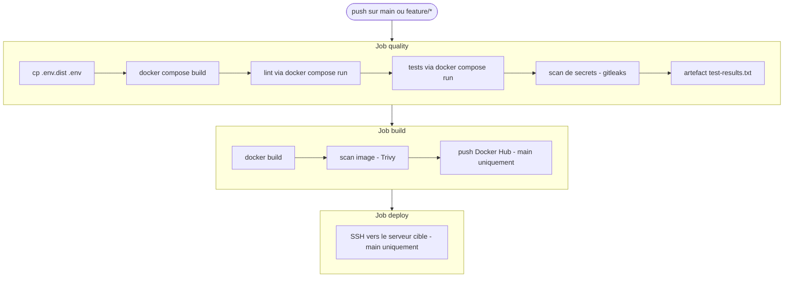

# SkillHub API — Chaîne CI/CD (EC06)

Dépôt : https://github.com/Aedery16-11/EC06-EderyAaron

Ce dépôt contient la mini API Express fournie, autour de laquelle j'ai construit une chaîne d'intégration et de déploiement continu reposant sur Git, Docker et GitHub Actions. Ce README sert aussi de rapport ; je l'ai organisé selon les quatre sections demandées.

Une précision importante avant tout,   mes trois jobs ne sont pas tous au vert. Les jobs `quality` et `build` passent, mais le job `deploy` est actuellement en rouge. Et c'est normal car j'ai choisi un déploiement SSH réel plutôt qu'un déploiement simulé, et  je ne dispose pas aujourd'hui d'un vrai serveur cible. La connexion SSH échoue donc faute d'hôte joignable, ce qui fait échouer l'étape. La logique de déploiement est néanmoins écrite et fonctionnelle dès qu'un serveur et les secrets associés seront disponibles.

## 1. Workflow Git et Docker

J'ai retenu une stratégie proche du **Trunk-Based Development**, que j'ai jugée adaptée à une épreuve individuelle. La branche `main` est la branche de référence, stable, et destinée à recevoir les livraisons validées. J'ai travaillé sur une branche éphémère `feature/ci-cd`, sur laquelle j'ai développé l'ensemble de la conteneurisation et du pipeline, puis je l'ai fusionnée dans `main` via une Pull Request (PR #1). Je n'ai pas introduit de branche `develop`

Concernant la protection de `main` : en conditions réelles j'y appliquerais une règle interdisant le push direct, imposant le passage par une Pull Request et exigeant que la CI soit au vert avant fusion. Vu que c'est une épreuve je la décris ici à défaut de pouvoir la faire respecter strictement, la CI étant déclenchée sur `push` et non sur `pull_request`.

Le `Dockerfile` est **multistage**. Une première étape `builder`, basée sur `node:20-alpine`, installe les dépendances avec `npm ci`. Une seconde étape `runner`, elle aussi sur `node:20-alpine` pour rester légère, ne récupère que ce qui est nécessaire à l'exécution : les dépendances, le code source, les tests et la configuration ESLint. Je crée un utilisateur non-root (`appuser`) et je bascule dessus avant l'exécution, pour ne jamais lancer l'application en root. Le port 3000 est exposé explicitement via `EXPOSE`, et un `HEALTHCHECK` interroge régulièrement l'endpoint `/health` pour signaler l'état du conteneur.

Le `docker-compose.yml` permet de lancer l'ensemble avec une seule commande. Il définit un service applicatif `app` construit à partir du `Dockerfile`, un service `db` PostgreSQL, un volume `postgres_data` pour la persistance des données, et charge les variables via la directive `env_file` pointant sur `.env`. Le fichier `.env` n'est pas versionné : seul `.env.dist`, sans secret réel, l'est.

## 2. Architecture du pipeline CI/CD

Le workflow se déclenche sur chaque `push`, aussi bien sur `main` que sur les branches `feature/*`. Il est composé de trois jobs enchaînés : `quality`, `build`, puis `deploy`.



Le job `quality` recrée le fichier `.env` à partir de `.env.dist`, construit l'image, puis exécute le lint et les tests **à l'intérieur de Docker** via `docker compose run --rm app`. Ce choix est volontaire : il valide que le `docker-compose.yml` est réellement fonctionnel et reproductible. Les résultats de tests sont publiés en artefact. J'y ai ajouté un scan de secrets avec gitleaks.

Le job `build` construit l'image, la fait analyser par Trivy (scan de vulnérabilités), et pousse l'image sur Docker Hub avec un tag basé sur le SHA du commit ainsi qu'un tag `latest`, uniquement sur `main`.

Le job `deploy` ne s'exécute que sur `main` et se connecte en SSH au serveur cible pour y récupérer et relancer l'image. Comme indiqué en introduction, il est actuellement en rouge faute de serveur réel.

## 3. Gestion des secrets

Aucun secret réel n'apparaît en clair, ni dans le code, ni dans le workflow, ni dans les logs. Les valeurs sensibles sont stockées dans **GitHub Secrets** et injectées dans la CI via la syntaxe `${{ secrets.NOM }}`. Les secrets que j'utilise sont : `DOCKERHUB_USERNAME` et `DOCKERHUB_TOKEN` pour l'authentification au registre, `SSH_HOST`, `SSH_USER` et `SSH_KEY` pour le déploiement, ainsi que le `GITHUB_TOKEN` fourni automatiquement par GitHub.

Le fichier `.env` est explicitement ignoré dans `.gitignore` (`.env` et `.env.*`, avec une exception `!.env.dist`), ce qui garantit qu'il n'est jamais poussé. Seul `.env.dist`, contenant des valeurs d'exemple, est versionné. J'ai également restreint les permissions du `GITHUB_TOKEN` au niveau des jobs (`contents: read`, `security-events: write`) pour appliquer le principe de moindre privilège.

## 4. Instructions et limites

Pour cloner et lancer l'application en local :

```
git clone git@github.com:Aedery16-11/EC06-EderyAaron.git
cd EC06-EderyAaron
cp .env.dist .env
docker compose up
```

L'API est alors accessible sur `http://localhost:5000`, avec l'endpoint `/health`.

Ce que je n'ai pas fait, faute de temps ou de moyens : le job `deploy` n'aboutit pas car je n'ai pas de serveur réel à disposition ; je n'ai pas non plus mis en place le cache des dépendances npm ni de matrice de build sur plusieurs versions de Node.

Améliorations que j'envisagerais ensuite : basculer le déploiement vers un PaaS gratuit (Render, Fly.io) pour obtenir un job `deploy` réellement vert, ajouter le cache npm pour accélérer la CI, mettre en place des releases automatisées, et compléter avec un environnement de preview par branche.
